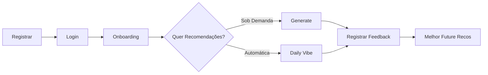

# 📚 MusicSelector API - Swagger Documentation

## 🚀 Acessar Swagger UI

Quando o servidor está rodando, acesse a documentação interativa em:

```
http://localhost:3000/api/docs
```

## 📋 Resumo das Rotas

### 🔐 **AUTH**

| Método | Rota | Descrição | Auth |
|--------|------|-----------|------|
| POST | `/auth/login` | Login com email e senha | ❌ |

---

### 👥 **USERS**

| Método | Rota | Descrição | Auth |
|--------|------|-----------|------|
| POST | `/users/register` | Registrar novo usuário | ❌ |
| POST | `/users/login` | Login de usuário | ❌ |
| POST | `/users/forgot-password` | Solicitar reset de senha | ❌ |
| POST | `/users/reset-password` | Resetar senha | ❌ |
| POST | `/users/{id}/onboarding` | Completar onboarding | ❌ |
| PATCH | `/users/{id}` | Atualizar perfil | ❌ |
| DELETE | `/users/{id}` | Deletar conta (soft delete) | ❌ |
| DELETE | `/users/{id}/hard` | Hard delete permanente | ❌ |
| POST | `/users/logout` | Logout | ❌ |
| GET | `/users` | Listar todos (dev only) | ❌ |
| GET | `/users/{id}` | Obter dados do usuário | ❌ |

---

### 🎵 **RECOMMENDATIONS** (Requer JWT Token)

| Método | Rota | Descrição | Auth |
|--------|------|-----------|------|
| POST | `/api/recommendations/generate` | Gerar recomendações sob demanda | ✅ |
| GET | `/api/recommendations/daily-vibe` | Gerar vibe diária | ✅ |
| GET | `/api/recommendations/vibes` | Listar vibes diárias | ✅ |
| GET | `/api/recommendations/history` | Histórico de playlists | ✅ |
| GET | `/api/recommendations/feedback` | Histórico de feedback | ✅ |
| GET | `/api/recommendations/feedback/stats` | Estatísticas de feedback | ✅ |
| POST | `/api/recommendations/feedback` | Registrar feedback (like/dislike) | ✅ |
| GET | `/api/recommendations/{playlistId}` | Detalhes da playlist | ✅ |
| DELETE | `/api/recommendations/{playlistId}` | Deletar playlist | ✅ |

---

## 🔑 Autenticação

### 1️⃣ **Registrar Novo Usuário**

```bash
POST /users/register
Content-Type: application/json

{
  "name": "João Silva",
  "email": "joao@example.com",
  "emailConfirmation": "joao@example.com",
  "password": "MyPassword123!",
  "passwordConfirmation": "MyPassword123!",
  "dateOfBirth": "2005-01-15"
}
```

**Resposta (201):**
```json
{
  "id": "uuid",
  "name": "João Silva",
  "email": "joao@example.com",
  "message": "Usuário criado com sucesso. Complete o onboarding."
}
```

---

### 2️⃣ **Login**

```bash
POST /auth/login
Content-Type: application/json

{
  "email": "joao@example.com",
  "password": "MyPassword123!"
}
```

**Resposta (200):**
```json
{
  "access_token": "eyJhbGciOiJIUzI1NiIsInR5cCI6IkpXVCJ9.eyJzdWIiOiIxMjM0NTY3ODkwIiwiZW1haWwiOiJqb2FvQGV4YW1wbGUuY29tIn0...."
}
```

---

### 3️⃣ **Completar Onboarding**

```bash
POST /users/{userId}/onboarding
Authorization: Bearer {access_token}
Content-Type: application/json

{
  "favoriteGenres": ["Rock", "Pop", "Jazz"],
  "audioPreference": "VOCAL"
}
```

---

## 🎵 Recomendações

### 4️⃣ **Gerar Recomendações Sob Demanda**

```bash
POST /api/recommendations/generate
Authorization: Bearer {access_token}
Content-Type: application/json

{
  "objective": "FOCUS",
  "mood": "HAPPY",
  "energyLevel": "HIGH",
  "limit": 10
}
```

**Enums disponíveis:**

- **Objective**: `FOCUS`, `RELAX`, `WORKOUT`, `PARTY`
- **Mood**: `HAPPY`, `NEUTRAL`, `ANXIOUS`, `SAD`
- **EnergyLevel**: `LOW`, `MEDIUM`, `HIGH`

**Resposta (200):**
```json
{
  "playlistId": "playlist_uuid",
  "playlistName": "My Focus Vibe",
  "objective": "FOCUS",
  "mood": "HAPPY",
  "energyLevel": "HIGH",
  "generatedAt": "2026-05-14T12:00:00Z",
  "tracks": [
    {
      "id": "spotify_id_1",
      "title": "Song Title",
      "artist": "Artist Name",
      "album": "Album Name",
      "genre": "Rock",
      "popularity": 85,
      "features": {
        "energy": 0.75,
        "valence": 0.65,
        "danceability": 0.7,
        "acousticness": 0.1,
        "instrumentalness": 0.05,
        "tempo": 120
      }
    }
    // ... 10 faixas
  ],
  "totalTracks": 10
}
```

---

### 5️⃣ **Gerar Vibe Diária**

```bash
GET /api/recommendations/daily-vibe
Authorization: Bearer {access_token}
```

Retorna recomendações automáticas recalculadas a cada 24h baseadas no perfil do usuário.

---

### 6️⃣ **Listar Histórico de Playlists**

```bash
GET /api/recommendations/history?limit=10
Authorization: Bearer {access_token}
```

---

### 7️⃣ **Registrar Feedback (Like/Dislike)**

```bash
POST /api/recommendations/feedback
Authorization: Bearer {access_token}
Content-Type: application/json

{
  "trackId": "spotify_track_id",
  "reaction": "LIKE",
  "objectiveContext": "FOCUS"
}
```

**Reações disponíveis:** `LIKE`, `DISLIKE`

**Regra RN24:** Ao fazer DISLIKE, a música nunca mais é sugerida naquele contexto.

---

### 8️⃣ **Obter Estatísticas de Feedback**

```bash
GET /api/recommendations/feedback/stats
Authorization: Bearer {access_token}
```

Retorna análise de padrões de likes/dislikes por contexto.

---

## 🔒 Segurança & Rate Limiting

### Rate Limit

- **Login** (`/auth/login`, `/users/login`): **5 tentativas por minuto**
  - Após 5 falhas, recebe `429 Too Many Requests`

### Validações (RNF-S01, RNF-S02, RNF-S03)

- **Nome**: máximo 50 caracteres, sem números e caracteres especiais
- **Email**: formato válido, máximo 100 caracteres
- **Senha**: mínimo 8 caracteres, hash com BCrypt
- **Sanitização**: proteção contra SQL Injection e XSS

---

## 📊 Fluxo de Uso Completo



---

## 🛠️ Arquivo Swagger JSON

Se preferir usar em ferramentas como **Postman** ou **Insomnia**, importe:

```
/swagger.json
```

---

## 📝 Exemplos cURL

### Login

```bash
curl -X POST http://localhost:3000/auth/login \
  -H "Content-Type: application/json" \
  -d '{"email":"joao@example.com","password":"MyPassword123!"}'
```

### Gerar Recomendações

```bash
curl -X POST http://localhost:3000/api/recommendations/generate \
  -H "Authorization: Bearer YOUR_TOKEN" \
  -H "Content-Type: application/json" \
  -d '{
    "objective":"FOCUS",
    "mood":"HAPPY",
    "energyLevel":"HIGH",
    "limit":10
  }'
```

### Registrar Feedback

```bash
curl -X POST http://localhost:3000/api/recommendations/feedback \
  -H "Authorization: Bearer YOUR_TOKEN" \
  -H "Content-Type: application/json" \
  -d '{
    "trackId":"spotify_id",
    "reaction":"LIKE",
    "objectiveContext":"FOCUS"
  }'
```

---

## 📞 Status Codes

| Code | Meaning |
|------|---------|
| 200 | ✅ OK - Requisição bem-sucedida |
| 201 | ✅ Created - Recurso criado |
| 400 | ❌ Bad Request - Dados inválidos |
| 401 | ❌ Unauthorized - Token inválido/expirado |
| 404 | ❌ Not Found - Recurso não encontrado |
| 409 | ❌ Conflict - Email já cadastrado |
| 429 | ❌ Too Many Requests - Rate limit atingido |
| 500 | ❌ Server Error - Erro interno |

---

## 🎓 Referência de Regras de Negócio

### Autenticação & Cadastro
- **RN01-RN06**: Validação de cadastro
- **RN07-RN09**: Login com JWT
- **RNF-S03**: Hash BCrypt para senhas
- **RNF-S04**: Rate limiting para login

### Onboarding
- **RN10-RN13**: Wizard de 3 passos obrigatório

### Recomendações
- **RN14-RN15**: Vibes Diárias automáticas
- **RN17-RN22**: 10 faixas ordenadas por relevância
- **RN23-RN24**: Like/Dislike bloqueia no contexto
- **RN29-RN30**: LGPD - Soft e hard delete com anonimização

---

## 🚀 Próximos Passos

1. Rodar servidor: `npm run start:dev`
2. Acessar Swagger: `http://localhost:3000/api/docs`
3. Testar rotas interativamente na UI
4. Implementar ML microserviço em Python para recomendações avançadas
