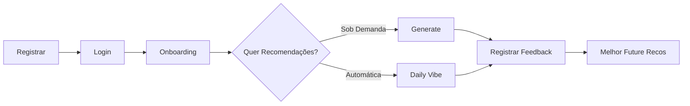

# 📚 MusicSelector API - Swagger Documentation

## 🚀 Acessar Swagger UI

Quando o servidor está rodando, acesse a documentação interativa em:

```
http://localhost:3000/api/docs
```

## 📋 Resumo das Rotas

### 🔐 **AUTH**

| Método | Rota | Descrição | Auth |
|--------|------|-----------|------|
| POST | `/auth/register` | Registrar novo usuário | ❌ |
| POST | `/auth/login` | Login com email e senha | ❌ |
| POST | `/auth/forgot-password` | Solicitar reset de senha | ❌ |
| POST | `/auth/reset-password` | Resetar senha | ❌ |

---

### 👥 **USERS**

| Método | Rota | Descrição | Auth |
|--------|------|-----------|------|
| GET | `/users/{id}` | Obter dados do usuário | ✅ |
| PATCH | `/users/{id}` | Atualizar perfil | ✅ |
| POST | `/users/{id}/onboarding` | Completar onboarding | ✅ |
| POST | `/users/logout` | Logout | ✅ |
| DELETE | `/users/{id}` | Deletar conta (soft delete - LGPD) | ✅ |
| DELETE | `/users/{id}/hard` | Hard delete permanente | ✅ |
| GET | `/users` | Listar todos (admin only) | ✅ Admin |

---

### 🎵 **RECOMMENDATIONS** (Requer JWT Token)

| Método | Rota | Descrição | Auth |
|--------|------|-----------|------|
| POST | `/api/recommendations/generate` | Gerar recomendações sob demanda | ✅ |
| GET | `/api/recommendations/daily-vibe` | Gerar vibe diária | ✅ |
| GET | `/api/recommendations/vibes` | Listar vibes diárias | ✅ |
| GET | `/api/recommendations/history` | Histórico de playlists | ✅ |
| GET | `/api/recommendations/feedback` | Histórico de feedback | ✅ |
| GET | `/api/recommendations/feedback/stats` | Estatísticas de feedback | ✅ |
| POST | `/api/recommendations/feedback` | Registrar feedback (like/dislike) | ✅ |
| GET | `/api/recommendations/{playlistId}` | Detalhes da playlist | ✅ |
| DELETE | `/api/recommendations/{playlistId}` | Deletar playlist | ✅ |

---

## 🔑 Autenticação

### 1️⃣ **Registrar Novo Usuário** 🔓

```bash
POST /auth/register
Content-Type: application/json

{
  "name": "João Silva",
  "email": "joao@example.com",
  "emailConfirmation": "joao@example.com",
  "password": "MyPassword123!",
  "passwordConfirmation": "MyPassword123!",
  "dateOfBirth": "2005-01-15"
}
```

**Resposta (201):**
```json
{
  "id": "uuid",
  "name": "João Silva",
  "email": "joao@example.com",
  "message": "Usuário criado com sucesso. Complete o onboarding."
}
```

**Validações (RN01-RN06):**
- Email único e máx 100 caracteres
- Senha mínimo 8 caracteres (letra + número)
- Confirmações devem bater
- Idade mínima 13 anos

---

### 2️⃣ **Login** 🔓

```bash
POST /auth/login
Content-Type: application/json

{
  "email": "joao@example.com",
  "password": "MyPassword123!"
}
```

**Resposta (200):**
```json
{
  "access_token": "eyJhbGciOiJIUzI1NiIsInR5cCI6IkpXVCJ9.eyJzdWIiOiI...",
  "user": {
    "id": "uuid",
    "name": "João Silva",
    "email": "joao@example.com"
  }
}
```

**Rate Limiting:** 5 tentativas por minuto (RNF-S04)

**Regra (RN07-RN09):** Acesso somente com email e senha corretos. Retorna JWT token para futuras requisições.

---

### 3️⃣ **Esqueci Minha Senha** 🔓

```bash
POST /auth/forgot-password
Content-Type: application/json

{
  "email": "joao@example.com"
}
```

**Resposta (200):**
```json
{
  "message": "Se o email existe, um link de recuperação foi enviado"
}
```

**Regra (RN08):** Valida existência do email antes de disparar link de recuperação

---

### 4️⃣ **Resetar Senha** 🔓

```bash
POST /auth/reset-password
Content-Type: application/json

{
  "token": "reset_token_from_email",
  "password": "NewPassword456!",
  "passwordConfirmation": "NewPassword456!"
}
```

**Resposta (200):**
```json
{
  "message": "Senha resetada com sucesso"
}
```

---

## 👤 Usuários

### 5️⃣ **Completar Onboarding** 🔐

```bash
POST /users/{userId}/onboarding
Authorization: Bearer {access_token}
Content-Type: application/json

{
  "favoriteGenres": ["Rock", "Pop", "Jazz"],
  "audioPreference": "VOCAL"
}
```

**AudioPreference disponíveis (RN12):** `VOCAL`, `INSTRUMENTAL`, `MIXED`

**Gêneros (RN11):** Mínimo 1, Máximo 5

**Regra (RN10-RN13):** Apresentado obrigatoriamente no primeiro login. Dados gravados imediatamente para mitigar o Cold Start.

---

### 6️⃣ **Atualizar Perfil** 🔐

```bash
PATCH /users/{userId}
Authorization: Bearer {access_token}
Content-Type: application/json

{
  "name": "João Silva Santos"
}
```

**Restrições (RN26):**
- Nome editável (máx 50 caracteres)
- Email e Data de Nascimento **imutáveis**

---

### 7️⃣ **Obter Dados do Usuário** 🔐

```bash
GET /users/{userId}
Authorization: Bearer {access_token}
```

**Resposta (200):**
```json
{
  "id": "uuid",
  "name": "João Silva",
  "email": "joao@example.com",
  "birthDate": "2005-01-15",
  "onboardingDone": true,
  "createdAt": "2026-05-18T10:00:00Z",
  "updatedAt": "2026-05-18T10:00:00Z"
}
```

---

### 8️⃣ **Logout** 🔐

```bash
POST /users/logout
Authorization: Bearer {access_token}
```

**Resposta (200):**
```json
{
  "message": "Logout bem-sucedido"
}
```

**Regra (RN31):** Invalida o JWT localmente no cliente

---

### 9️⃣ **Deletar Conta - Soft Delete (LGPD)** 🔐

```bash
DELETE /users/{userId}
Authorization: Bearer {access_token}
```

**Resposta (200):**
```json
{
  "message": "Conta deletada com sucesso"
}
```

**Regra (RN30):**
- Apaga dados sensíveis (Nome, Email)
- Mantém histórico de feedback anonimizado para não prejudicar o ML

---

### 🔟 **Hard Delete - Permanente** 🔐

```bash
DELETE /users/{userId}/hard
Authorization: Bearer {access_token}
```

**Resposta (200):**
```json
{
  "message": "Usuário permanentemente deletado"
}
```

**Efeito:** Remove completamente o usuário e todos os dados

---

## 🎵 Recomendações

### 11 **Gerar Recomendações Sob Demanda** 🔐

```bash
POST /api/recommendations/generate
Authorization: Bearer {access_token}
Content-Type: application/json

{
  "objective": "FOCUS",
  "mood": "HAPPY",
  "energyLevel": "HIGH",
  "limit": 10
}
```

**Parâmetros (RN17-RN20):**
- **Objective** (obrigatório): `FOCUS`, `RELAX`, `WORKOUT`, `MOOD_BOOST`
- **Mood** (obrigatório): `HAPPY`, `NEUTRAL`, `ANXIOUS`, `SAD`
- **EnergyLevel** (obrigatório): `LOW`, `MEDIUM`, `HIGH`
- **limit** (opcional): 1-50, padrão 20

**Resposta (200):**
```json
{
  "playlistId": "uuid",
  "playlistName": "Foco Total - Feliz",
  "objective": "FOCUS",
  "mood": "HAPPY",
  "energyLevel": "HIGH",
  "generatedAt": "2026-05-18T12:00:00Z",
  "tracks": [
    {
      "id": "track_1",
      "title": "Song Name",
      "artist": "Artist Name",
      "album": "Album",
      "genre": "Rock",
      "popularity": 85,
      "features": {
        "energy": 0.8,
        "valence": 0.9,
        "danceability": 0.7,
        "acousticness": 0.1,
        "instrumentalness": 0.05,
        "tempo": 120
      },
      "explanation": "Recomendada por: ritmo energético perfeito para exercício"
    }
  ],
  "totalTracks": 10
}
```

---

### 12 **Gerar Vibe Diária** 🔐

```bash
GET /api/recommendations/daily-vibe
Authorization: Bearer {access_token}
```

**Resposta:** Mesma estrutura de Gerar Recomendações

**Regra (RN14-RN15):**
- Recomendações automáticas baseadas no perfil do usuário
- Recalculadas a cada 24 horas
- Objetivo e mood determinados automaticamente por horário do dia

---

### 13 **Listar Vibes Diárias** 🔐

```bash
GET /api/recommendations/vibes
Authorization: Bearer {access_token}
```

**Resposta (200):**
```json
[
  {
    "playlistId": "uuid_1",
    "playlistName": "Vibe Diária - 18/05/2026",
    "objective": "FOCUS",
    "energyLevel": "MEDIUM",
    "generatedAt": "2026-05-18T00:00:00Z",
    "tracks": [ ... ]
  }
]
```

---

### 14 **Histórico de Playlists** 🔐

```bash
GET /api/recommendations/history?limit=10
Authorization: Bearer {access_token}
```

**Query Parameters:**
- `limit` (opcional): Número de resultados, padrão 10

**Resposta (200):** Array de playlists do usuário ordenadas por data

---

### 15 **Obter Detalhes da Playlist** 🔐

```bash
GET /api/recommendations/{playlistId}
Authorization: Bearer {access_token}
```

**Resposta (200):** Detalhes completos da playlist com todas as tracks

---

### 16 **Deletar Playlist** 🔐

```bash
DELETE /api/recommendations/{playlistId}
Authorization: Bearer {access_token}
```

**Resposta (200):**
```json
{
  "message": "Playlist deletada com sucesso"
}
```

---

### 17 **Registrar Feedback (Like/Dislike)** 🔐

```bash
POST /api/recommendations/feedback
Authorization: Bearer {access_token}
Content-Type: application/json

{
  "trackId": "spotify_track_id",
  "reaction": "LIKE",
  "objectiveContext": "FOCUS"
}
```

**Parâmetros (RN23):**
- **trackId** (obrigatório): ID da música
- **reaction** (obrigatório): `LIKE` ou `DISLIKE`
- **objectiveContext** (obrigatório): `FOCUS`, `RELAX`, `WORKOUT`, `MOOD_BOOST`

**Resposta (201):**
```json
{
  "id": "feedback_uuid",
  "trackId": "spotify_id",
  "reaction": "LIKE",
  "objectiveContext": "FOCUS",
  "createdAt": "2026-05-18T12:00:00Z"
}
```

**Regra (RN24):** Dislike bloqueia a música naquele contexto para sempre

---

### 18 **Histórico de Feedback** 🔐

```bash
GET /api/recommendations/feedback?limit=50
Authorization: Bearer {access_token}
```

**Query Parameters:**
- `limit` (opcional): Número de resultados, padrão 50

**Resposta (200):** Array de likes/dislikes do usuário

---

### 19 **Estatísticas de Feedback** 🔐

```bash
GET /api/recommendations/feedback/stats
Authorization: Bearer {access_token}
```

**Resposta (200):**
```json
{
  "totalLikes": 45,
  "totalDislikes": 12,
  "likesByObjective": {
    "FOCUS": 20,
    "WORKOUT": 15,
    "RELAX": 10,
    "MOOD_BOOST": 0
  },
  "dislikesByObjective": {
    "FOCUS": 3,
    "WORKOUT": 6,
    "RELAX": 2,
    "MOOD_BOOST": 1
  }
}
```

---

## 🔒 Segurança & Rate Limiting

### Rate Limit

- **Login & Register** (`/auth/login`, `/auth/register`): **5 tentativas por minuto**
  - Após 5 falhas, recebe `429 Too Many Requests` (RNF-S04)

### Validações (RNF-S01, RNF-S02, RNF-S03)

- **Nome**: máximo 50 caracteres, sem números e caracteres especiais
- **Email**: formato válido, máximo 100 caracteres
- **Senha**: mínimo 8 caracteres, hash com BCrypt
- **Sanitização**: proteção contra SQL Injection e XSS

---

## 📊 Fluxo de Uso Completo



---

## 🛠️ Arquivo Swagger JSON

Se preferir usar em ferramentas como **Postman** ou **Insomnia**, importe:

```
/swagger.json
```

---

## 📝 Exemplos cURL

### Registrar

```bash
curl -X POST http://localhost:3000/auth/register \
  -H "Content-Type: application/json" \
  -d '{
    "name":"João Silva",
    "email":"joao@example.com",
    "emailConfirmation":"joao@example.com",
    "password":"MyPassword123!",
    "passwordConfirmation":"MyPassword123!",
    "dateOfBirth":"2005-01-15"
  }'
```

### Login

```bash
curl -X POST http://localhost:3000/auth/login \
  -H "Content-Type: application/json" \
  -d '{"email":"joao@example.com","password":"MyPassword123!"}'
```

### Gerar Recomendações

```bash
curl -X POST http://localhost:3000/api/recommendations/generate \
  -H "Authorization: Bearer YOUR_TOKEN" \
  -H "Content-Type: application/json" \
  -d '{
    "objective":"FOCUS",
    "mood":"HAPPY",
    "energyLevel":"HIGH",
    "limit":10
  }'
```

### Registrar Feedback

```bash
curl -X POST http://localhost:3000/api/recommendations/feedback \
  -H "Authorization: Bearer YOUR_TOKEN" \
  -H "Content-Type: application/json" \
  -d '{
    "trackId":"spotify_id",
    "reaction":"LIKE",
    "objectiveContext":"FOCUS"
  }'
```

---

## 📞 Status Codes

| Code | Meaning |
|------|---------|
| 200 | ✅ OK - Requisição bem-sucedida |
| 201 | ✅ Created - Recurso criado |
| 400 | ❌ Bad Request - Dados inválidos |
| 401 | ❌ Unauthorized - Token inválido/expirado |
| 404 | ❌ Not Found - Recurso não encontrado |
| 409 | ❌ Conflict - Email já cadastrado |
| 429 | ❌ Too Many Requests - Rate limit atingido |
| 500 | ❌ Server Error - Erro interno |

---

## 🎓 Referência de Regras de Negócio

### Autenticação & Cadastro
- **RN01-RN06**: Validação de cadastro
- **RN07-RN09**: Login com JWT
- **RNF-S03**: Hash BCrypt para senhas
- **RNF-S04**: Rate limiting para login

### Onboarding
- **RN10-RN13**: Wizard de 3 passos obrigatório

### Recomendações
- **RN14-RN15**: Vibes Diárias automáticas
- **RN17-RN22**: 10+ faixas ordenadas por relevância
- **RN23-RN24**: Like/Dislike bloqueia no contexto
- **RN30-RN31**: LGPD - Soft e hard delete com anonimização

---

## 🚀 Próximos Passos

1. Rodar servidor: `npm run start:dev`
2. Acessar Swagger: `http://localhost:3000/api/docs`
3. Testar rotas interativamente na UI
